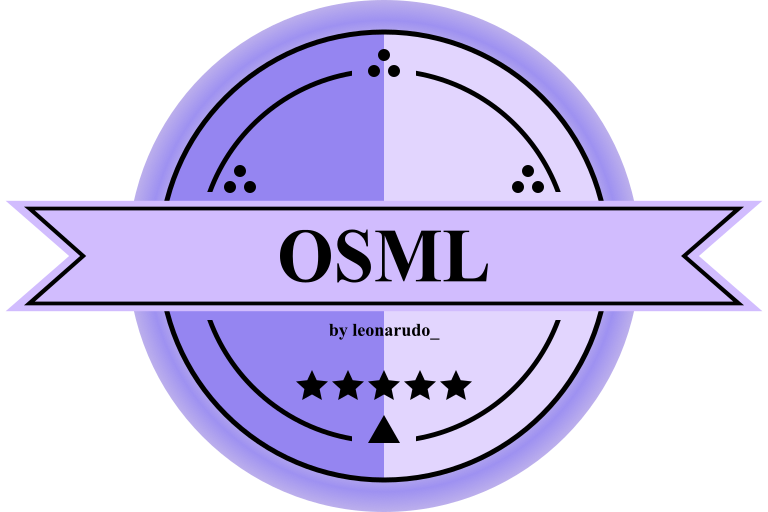

  

<h1 align="center">Obenseuer Simple Modding Library</h1>

**Obenseuer Simple Modding Library** is a powerful and user-friendly library mod designed to simplify the process of modding the game [Obenseuer](https://store.steampowered.com/app/951240/Obenseuer/) using its unofficial mod loader, [OSLoader](https://github.com/Ierdna100/OSLoader). 
Written in C# and targeting .NET Standard 2.1, this library provides a streamlined framework for mod developers to enhance and extend the game's functionality with ease.

## Features:
- **Simplified API:** A straightforward API that abstracts away the complexities of modding, allowing developers to focus on their creative ideas.
- **Extensibility:** Designed to be extended with additional features and functionalities, making it a robust foundation for your modding projects.
- **Furniture Creation:** Easily create and add custom furniture to the game, complete with all necessary attributes and behaviors for saving and loading.
- *and more soon!*

## Getting Started
- [Installation Guide]() *WIP*
- [Library Documentation]() *WIP*

## Contributing
Contributions are welcome! Whether you're fixing bugs, adding new features, or improving documentation, your help is appreciated. To contribute, please fork the repository and submit a pull request. For major changes, please open an issue first to discuss what you would like to change.

## License
This project is licensed under the [GPL-3.0 license](LICENSE)
